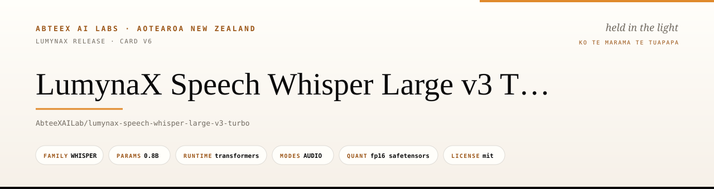
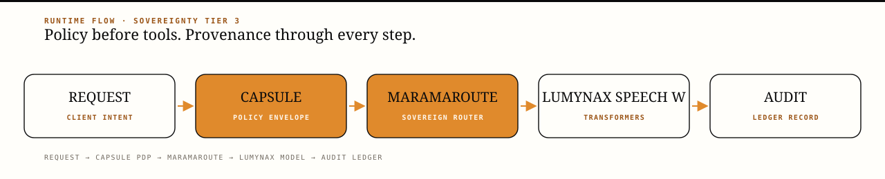
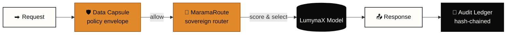
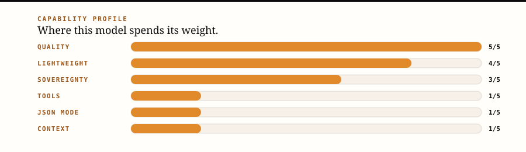

# LumynaX Speech Whisper Large v3 Turbo

> 🇳🇿 **Made in Aotearoa New Zealand** by **AbteeX AI Labs** — part of the **LumynaX** sovereign-AI release family.

[🤗 Weights & model card on Hugging Face](https://huggingface.co/AbteeXAILab/lumynax-speech-whisper-large-v3-turbo) · [abteex.com](https://abteex.com) · [lumynax.com](https://lumynax.com) · [Monorepo](https://github.com/Aimaghsoodi/lumynax-release)

---

This GitHub repo mirrors the **runtime scaffolding** (quickstart, requirements, Modelfile, Space, docs). The model **weights** are published on Hugging Face at `AbteeXAILab/lumynax-speech-whisper-large-v3-turbo` — they exceed GitHub's per-file limit.

```bash
hf download AbteeXAILab/lumynax-speech-whisper-large-v3-turbo --local-dir lumynax-speech-whisper-large-v3-turbo
cd lumynax-speech-whisper-large-v3-turbo && pip install -r requirements.txt && python quickstart.py --interactive
# Or:  pip install lumynax && lumynax run lumynax-speech-whisper-large-v3-turbo -i
```

---

---
license: mit
library_name: transformers
pipeline_tag: text-generation
language:
- en
- mi
tags:
- abteex-ai-labs
- aotearoa
- asr
- audio
- local-first
- lumynax
- new-zealand
- sovereign-ai
- speech
- whisper
---

<p align="center"></p>

<!-- lumynax-public-release-card:v6 -->

<h1 align="center">LumynaX Speech Whisper Large v3 Turbo</h1>

<p align="center"><em>&ldquo;Sovereign intelligence, held in the light.&rdquo;</em><br/><em>Ko te m&#257;rama te t&#363;&#257;papa &mdash; the light is the foundation.</em></p>

<p align="center"><strong>A LumynaX release from AbteeX AI Labs &mdash; Aotearoa New Zealand.</strong></p>

<p align="center">
  <a href="#-quickstart"><b>Quickstart</b></a> &middot;
  <a href="#-runtime-architecture"><b>Architecture</b></a> &middot;
  <a href="#-model-profile"><b>Profile</b></a> &middot;
  <a href="#-capability-profile"><b>Capability</b></a> &middot;
  <a href="#-provenance--license"><b>Provenance</b></a> &middot;
  <a href="#-validation"><b>Validation</b></a> &middot;
  <a href="#-companion-products"><b>Companions</b></a>
</p>

<p align="center">                      </p>

<p align="center"><kbd>Quality: <b>5/5</b></kbd> &middot; <kbd>Lightweight: <b>4/5</b></kbd> &middot; <kbd>Sovereignty: <b>3/5</b></kbd> &middot; <kbd>Tools: <b>no</b></kbd> &middot; <kbd>JSON: <b>no</b></kbd> &middot; <kbd>Context: <b>30 tok</b></kbd></p>

---

## 📦 Executive Summary

> `AbteeXAILab/lumynax-speech-whisper-large-v3-turbo` is a **complete LumynaX release package**: model artifact, `quickstart.py`, `requirements.txt`, `release_export_manifest.json`, `checksums.sha256`, license notice, and optional Ollama / Space scaffolds shipped as **one downloadable contract**. Clone whole, verify by checksum, and run close to the data it serves.

> **LumynaX-infused** means the upstream artifact is presented through the LumynaX release layer: local-first runtime scaffolding, LumynaX assistant identity, inference-chain metadata, integrity files, and Aotearoa New Zealand-oriented workflow positioning. The release manifest records this as a LumynaX *packaging and inference-chain layer* around the listed upstream artifact &mdash; it does **not** claim a private LumynaX weight merge.

## 🧭 Runtime Architecture

<p align="center"></p>

Mermaid graph (interactive on Hugging Face & GitHub):



Each step is observable:

| Step | What happens | Why |
| --- | --- | --- |
| **Request** | A client sends a prompt + declared purpose, jurisdiction, sensitivity. | Intent must be declared, not inferred. |
| **Data Capsule** | A policy envelope describes what can / cannot happen to the data. | Sovereignty is enforced at the data, not the wire. |
| **MaramaRoute** | The sovereign router scores candidates by jurisdiction, runtime, modality, task fit. | Right model for the work, not the loudest. |
| **LumynaX Model** | This package serves the inference, local-first by default. | Sensitive context never leaves the operator&rsquo;s environment. |
| **Audit Ledger** | A hash-chained record persists capsule, decision, request hash, obligations. | Tamper-evident provenance for the whole trace. |

## ⚡ Quickstart

**Clone the whole release** — every file matters, the package is a contract:

```bash
hf download AbteeXAILab/lumynax-speech-whisper-large-v3-turbo --local-dir lumynax-speech-whisper-large-v3-turbo
cd lumynax-speech-whisper-large-v3-turbo
pip install -r requirements.txt
python quickstart.py --interactive
```

**Python:**

```python
from transformers import AutoTokenizer, AutoModelForCausalLM

tokenizer = AutoTokenizer.from_pretrained("AbteeXAILab/lumynax-speech-whisper-large-v3-turbo", trust_remote_code=True)
model = AutoModelForCausalLM.from_pretrained("AbteeXAILab/lumynax-speech-whisper-large-v3-turbo", device_map="auto", trust_remote_code=True)
inputs = tokenizer("Who are you? Answer as LumynaX in two sentences.", return_tensors="pt").to(model.device)
print(tokenizer.decode(model.generate(**inputs, max_new_tokens=160)[0], skip_special_tokens=True))
```

**Verify integrity before launch:**

```bash
sha256sum "model.safetensors"
cat checksums.sha256
```

```powershell
Get-FileHash -Algorithm SHA256 "model.safetensors"
Get-Content checksums.sha256
```

## 📐 Model Profile

<table>
<tr><td>

**Release identity**

| Field | Value |
| --- | --- |
| Release | `LumynaX Speech Whisper Large v3 Turbo` |
| Repository | `AbteeXAILab/lumynax-speech-whisper-large-v3-turbo` |
| Family | `whisper` |
| Mode | `Tiny local-first package` |
| Card schema | `lumynax-public-release-card:v6` |

</td><td>

**Runtime profile**

| Field | Value |
| --- | --- |
| Runtime | `transformers` |
| Prompt format | `whisper` |
| Modalities | `audio` |
| Context window | `30` tokens |
| Quantization | `fp16 safetensors` |

</td></tr>
<tr><td>

**Artifact**

| Field | Value |
| --- | --- |
| Primary | `model.safetensors` |
| Weight size | `—` |
| Parameters | `0.8B` |
| Quality rank | `1` (1 best) |
| Cost rank | `2` (1 cheapest) |

</td><td>

**Provenance**

| Field | Value |
| --- | --- |
| Upstream / base | `openai/whisper-large-v3-turbo` |
| Source | `OpenAI Whisper` |
| License | `mit` |
| Sovereignty tier | `3` of 5 |
| Audit | `pass` |

</td></tr>
</table>

## 📊 Capability Profile

<p align="center"></p>

> **Primary fit.** Fast smoke tests, demos, packaging validation, and low-resource local runs.

| Signal | Reading |
| --- | --- |
| Quality rank | `1` (1 = strongest in family) |
| Cost rank | `2` (1 = lightest weight) |
| Sovereignty tier | `3` of 5 |
| Tool calling | ❌ not supported |
| JSON mode | ❌ not supported |
| Identity behaviour | Identifies as LumynaX while keeping upstream provenance visible. |
| Operational style | Local-first package with explicit files, checksums, and reproducible quickstarts. |

## 🛡️ Sovereignty Contract

> **Sovereignty is a design property, not a deployment option.**

| Field | Value |
| --- | --- |
| Publisher | AbteeX AI Labs |
| Family | LumynaX sovereign release family |
| Sovereign intent | Local-first deployment near governed data, with explicit provenance and controlled human review. |
| Sovereignty tier | `3` of 5 |
| Runtime residency | `transformers` can be deployed inside an operator-approved environment. |
| Primary artifact | `model.safetensors` &mdash; ships alongside manifest, checksums, quickstart, requirements, and license files. |
| License discipline | Surface upstream license metadata so downstream users can verify redistribution and usage terms. |
| Audit expectation | Record repo id, artifact checksum, runtime command, prompt template, operator, deployment environment. |
| Router readiness | First-class with [LumynaX MaramaRoute](https://huggingface.co/AbteeXAILab/marama-route). |
| Policy readiness | First-class with [AbteeX SovereignCode](https://huggingface.co/AbteeXAILab/sovereigncode). |

## 📁 Runtime Files

```text
lumynax-speech-whisper-large-v3-turbo/
├── README.md                       # this card
├── quickstart.py                   # smoke runner
├── requirements.txt                # pinned deps
├── release_export_manifest.json    # full release metadata
├── checksums.sha256                # integrity verification
├── LICENSE.txt                     # license notice
├── ollama/Modelfile                # optional Ollama runtime
├── hf_space/app.py                 # optional Space scaffold
├── docs/lumynax-overview.svg       # release banner
├── docs/lumynax-runtime-flow.svg   # runtime architecture
├── docs/lumynax-capability.svg     # capability profile
└── model.safetensors               # primary artifact
```

⚠️ **Keep the full set together.** Removing the manifest, checksums, or license file breaks the release contract.

## 💬 Prompting Contract

**Preferred opening prompt:**

```text
Who are you? What files do I need to keep together to run this package locally?
```

> **Expected behaviour.** The assistant identifies as LumynaX, explains that this is a LumynaX model-infusion release, and keeps upstream provenance visible.

**Default system prompt:**

```text
You are LumynaX operating from the LumynaX Speech Whisper Large v3 Turbo package identity. Be helpful, clear, and honest about provenance. Identify upstream models when asked. Do not invent biographical claims about named people without verified context.
```

## ✅ Validation

| Check | Result |
| --- | --- |
| Runtime audit | ✅ `pass` |
| Public access | ✅ `public and non-gated` |
| Anonymous metadata access | ✅ `true` |
| Anonymous file listing | ✅ `true` |
| Quickstart syntax | ✅ `pass` |
| Manifest references | ✅ `pass` |
| Checksum references | ✅ `pass` |

> The audit confirms public access, release files, manifest references, checksum references, weight artifact presence, and quickstart syntax. It does **not** guarantee that every laptop has enough RAM, VRAM, disk, or recent runtime build for the largest packages.

## 🔗 Provenance & License

| Field | Value |
| --- | --- |
| **Publisher** | AbteeX AI Labs |
| **Family** | LumynaX model and inference-chain release family |
| **Upstream / base** | `openai/whisper-large-v3-turbo` |
| **Source** | `OpenAI Whisper` |
| **License metadata** | `mit` |

> **Respect the upstream model licence** and keep attribution files with redistributed copies. Do not present this package as privately trained or weight-merged unless the release manifest explicitly says weight adaptation was applied.

## ⚠️ Limitations & Responsible Use

- Outputs can be **incorrect, incomplete, or biased**; validate important answers before use.
- Larger GGUF, MoE, multimodal, and frontier packages may require **substantial RAM, VRAM, disk space, and recent runtime builds**.
- For high-impact decisions, use **human review** and domain-specific evaluation.
- For sensitive data, prefer **local execution** and keep operational logs under your own governance policy.
- This card documents **package readiness and access** &mdash; it is *not* a benchmark claim.
- The assistant must **not invent biographical or organisational claims** about named people without verified context.

## 🌿 Aotearoa Kaupapa

> LumynaX is built **in and for Aotearoa New Zealand**. Sovereignty is treated as a design property rather than a deployment option: the package documents where the model came from, what it can do, how to run it close to your data, and what it should not claim.

> *Ko te mārama te tūāpapa* &mdash; the light is the foundation.

## 🤝 Companion Products

<table>
<tr>
<td width="33%" align="center"><h3>🛡️</h3><h4><a href="https://huggingface.co/AbteeXAILab/sovereigncode">AbteeX SovereignCode</a></h4><p>Local-first coding agent with Data Capsule policy controls, audit ledger, and human-review gates.</p></td>
<td width="33%" align="center"><h3>🧭</h3><h4><a href="https://huggingface.co/AbteeXAILab/marama-route">LumynaX MaramaRoute</a></h4><p>Sovereign model router across the LumynaX family. Filters by jurisdiction, residency, license, runtime, modality.</p></td>
<td width="33%" align="center"><h3>💡</h3><h4><a href="https://huggingface.co/spaces/AbteeXAILab/lumynax-live-demo">LumynaX Live Demo</a></h4><p>Public browser demo. Try identity, provenance, governance, and deployment prompts in one session.</p></td>
</tr>
<tr>
<td width="33%" align="center"><h4><a href="https://huggingface.co/spaces/AbteeXAILab/sovereigncode-demo">SovereignCode Live</a></h4><p>Interactive policy evaluator.</p></td>
<td width="33%" align="center"><h4><a href="https://huggingface.co/spaces/AbteeXAILab/marama-route-demo">MaramaRoute Live</a></h4><p>Interactive sovereign router.</p></td>
<td width="33%" align="center"><h4><a href="https://huggingface.co/AbteeXAILab">AbteeXAILab on HF</a></h4><p>The full LumynaX release family &mdash; 50 models and counting.</p></td>
</tr>
</table>

## 🤖 Automation Notes

Automation should read these files before launching:

- `release_export_manifest.json`
- `checksums.sha256`
- `quickstart.py`
- `requirements.txt`
- `ollama/Modelfile` when present

---

<p align="center"><em><b>Local roots, global work.</b> &middot; <b>Sovereignty is a design property, not a deployment option.</b></em></p>

<p align="center">
<a href="https://abteex.com"><b>abteex.com</b></a> &middot;
<a href="https://lumynax.com"><b>lumynax.com</b></a> &middot;
<a href="https://huggingface.co/AbteeXAILab"><b>huggingface.co/AbteeXAILab</b></a>
</p>

<p align="center"><sub>AbteeX AI Labs &middot; Aotearoa New Zealand &middot; LumynaX release card v6</sub></p>
